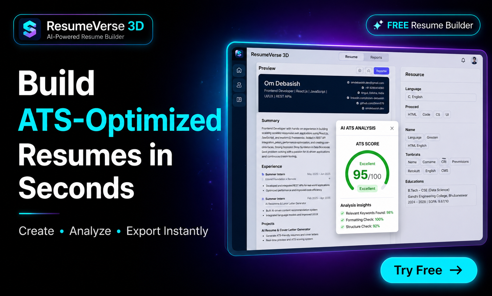

<div align="center">

# ✦ ResumeVerse 3D

### Build. Impress. Get Hired.

**A next-generation resume builder wrapped in an immersive 3D experience — with real-time ATS scoring, live preview, cloud sync, and one-click PDF export.**

[](https://nextjs.org)
[](https://reactjs.org)
[](https://threejs.org)
[](https://supabase.io)
[](https://tailwindcss.com)
[](https://www.framer.com/motion)
[](https://www.resumeverse3d.me)

<br />



</div>

---

## 📌 Overview

**ResumeVerse 3D** is a full-stack resume and cover letter builder that combines professional document generation with a cinematic 3D interface. It is designed for developers, designers, and job seekers who want their application tools to match the quality of their work.

Unlike generic resume builders, ResumeVerse 3D features a fully interactive WebGL background powered by React Three Fiber, scroll-driven animations, an ATS scoring engine, multi-template switching with live preview, cloud save via Supabase, and one-click PDF export — all wrapped in a dark, high-polish UI.

**Built for:** Students, fresh graduates, and early-career professionals who want to stand out.

---

## ✨ Features

### 🌌 Immersive 3D Landing Experience
- A full-screen WebGL canvas renders a scroll-reactive **torus knot** with distorted metallic material (`MeshDistortMaterial`), a transparent wireframe overlay, and a glowing inner sphere.
- The core shape **drifts horizontally** across the screen as the user scrolls, interpolating its X position between `-2` and `+2` based on scroll progress normalized against `window.innerHeight`.
- **Scroll velocity** is tracked frame-by-frame and smoothed to accelerate the shape's Y-axis rotation — faster scrolling = faster spin.
- 15 randomly placed **icosahedron debris** objects float independently using `@react-three/drei`'s `<Float>` component with per-instance speed variation.
- 800 custom **particle points** (400 on mobile) stored as a `Float32Array` buffer stretch along the Z-axis during scroll, creating a warp-speed effect. On page exit, the warp is spiked to 600 and the camera flies forward through the scene.
- **Bloom post-processing** adds a luminance-based glow halo around all emissive materials.
- The camera performs a subtle **idle sine-wave drift** and snaps back to origin on exit.
- A spring-interpolated **cursor glow** (`cyan-400`, 160×160 blur) follows the mouse with configurable stiffness/damping — disabled on mobile.

### 🎬 Cinematic Page Transitions
- Clicking "START CREATING" triggers an `isExiting` state that simultaneously: fades in a full-screen dark overlay, blurs and scales the content layer, and triggers the camera fly-through in the 3D scene.
- The router navigates to `/builder` after a 1000ms delay timed to match the transition.
- Navigation back to the mode selector plays an inverse transition with card-scale-up and sibling-card-scatter animations.

### 🔐 Authentication System (Supabase)
- Full **email/password sign-up and sign-in** powered by Supabase Auth.
- On signup, a row is inserted into a custom `users` table with `id`, `email`, and `name`.
- On login, the system checks if the user already exists in `users` and upserts if missing (handles OAuth edge cases).
- Email confirmation is enforced — unconfirmed users receive a contextual error message.
- The builder page performs a `supabase.auth.getUser()` check on mount and redirects unauthenticated users to `/login`.
- The login page features the full 3D scene as background, with a **parallax card tilt** driven by mouse position mapped to `±20px` spring values.

### 🏗️ Resume Builder Workspace
- A **split-pane layout** with a resizable left sidebar (editor) and a live preview pane. The divider supports **drag-to-resize** via pointer events, clamped between `80px` and `300px`, with double-click to reset.
- On mobile, the layout collapses to a **tab-switched view** (Editor / Preview) with a pill-style floating navigation bar.
- All form state is persisted to **`localStorage`** on every change, so data survives page refreshes.
- Users can **save to Supabase** (upserts a `resumes` table row keyed by `user_id`), which loads automatically on next login.
- **Undo Reset** buffers the previous state before a wipe, allowing a single-level rollback.

### 📋 Dynamic Resume Form
Organized into clearly labeled sections:
- **Application Details** — Company name, hiring manager (for cover letter linking)
- **Personal Info** — Name, role, email, phone, LinkedIn, GitHub
- **Professional Summary**
- **Technical Skills** — Split across: Languages, Frontend, Backend, Database, Tools, AI/ML, Core CS
- **Projects** — Dynamic list with title, tech stack, and multiple bullet points per entry
- **Internships** — Company, role, duration, location, and bullet points
- **Education** — Degree, school, year, score
- **Achievements, Certifications, Extracurriculars**
- **Strengths & Interests**

All dynamic sections support **add/remove items** and **add/remove nested bullet points** without page reloads.

### 🎨 Four Resume Templates
Switchable via a horizontally-scrolling visual selector with thumbnail previews and active glow:

| Template | Style |
|----------|-------|
| **Modern** | Dark header, two-column body layout with sidebar for skills/education |
| **Classic** | Traditional serif-influenced, bordered sections, professional tone |
| **Minimal** | Clean whitespace, subtle dividers, typography-first |
| **ATS Pro** | Single-column, plain text, maximum ATS parser compatibility |

The `<Preview>` component normalizes all incoming data (splits comma/newline-delimited strings, ensures arrays) before routing to the correct template component.

### 📊 Real-Time ATS Score Engine
A custom scoring algorithm runs client-side with a **600ms debounce** after every form change:

| Criterion | Max Points |
|-----------|-----------|
| Basic Info (name, role, email, phone) | 20 |
| Technical Skills completeness | 15 |
| Project title + 2+ bullet points | 15 |
| Internship/experience entry | 10 |
| Education (degree + school) | 10 |
| Summary length (≥80 chars) | 10 |
| Achievements + Certifications | 10 |
| Role-to-skills keyword match | 10 |

The score renders as an animated progress bar in the top-right corner with color grading (green / yellow / orange / red) and up to 3 actionable feedback items. The panel is dismissible.

### ✉️ Cover Letter Generator
- 7 pre-written professional cover letter templates that dynamically interpolate `name`, `role`, `company`, `hiringManager`, `frontend`, `backend`, `tools`, and `projects[0].title` from the shared form state.
- Clicking **Generate Letter** randomly selects one template, injects the user's data, and stores the result back into state.
- The cover letter renders inside the same live preview pane with animated template transitions (`AnimatePresence`).
- The cover letter is editable directly inside the preview component via a `contentEditable` or `<textarea>` interface.

### 📥 PDF Export
- Uses the browser's native `window.print()` API with a carefully crafted `@media print` CSS block that hides all UI chrome (header, sidebar, 3D background, navigation bars) and renders the resume paper at `210mm × 297mm` (A4) with `print-color-adjust: exact` to preserve background colors.

### 🤖 Local AI Integration (Ollama)
- A Next.js API route at `/api/generate` proxies requests to a locally running **Ollama** instance using the `llama3` model.
- Supports both **streaming** (via `ReadableStream` + `TextDecoder`) and **non-streaming** modes, controlled by a `stream` boolean in the request body.
- The streaming handler reads NDJSON line-by-line, parsing each chunk and re-encoding only the `response` field to the client.

---

## 🛠️ Tech Stack

### Frontend
- **Next.js 16.2** — App Router, SSR-disabled for 3D components via `dynamic(() => ..., { ssr: false })`
- **React 19** — Latest concurrent features
- **TypeScript** — Type-safe layout and config files

### 3D & Graphics
- **Three.js r183** — Core WebGL rendering
- **@react-three/fiber** — React renderer for Three.js (`useFrame`, `useThree`, `Canvas`)
- **@react-three/drei** — `Stars`, `Float`, `MeshDistortMaterial`, `Icosahedron`
- **@react-three/postprocessing** — `EffectComposer`, `Bloom`

### Animation
- **Framer Motion v12** — `motion`, `AnimatePresence`, `useMotionValue`, `useSpring`, `whileHover`, `whileInView`, `whileTap`

### Styling
- **Tailwind CSS v4** — Utility-first styling with PostCSS pipeline
- **Geist & Geist Mono** — Google Fonts via `next/font`

### Auth & Database
- **Supabase** — Authentication (email/password), `users` table, `resumes` table
- **@supabase/ssr** + **@supabase/auth-helpers-nextjs** — Server-side auth utilities

### AI / Backend
- **Ollama** (local) — LLM inference via REST, `llama3` model
- **OpenAI SDK** — Installed, available for future integration
- **@google/genai** + **@google/generative-ai** — Installed for Gemini integration
- **@openrouter/sdk** — Multi-provider LLM routing

### Export
- **html2pdf.js** — PDF generation utility (installed, `window.print()` used in current implementation)

### Icons & UI
- **lucide-react** — `Download`, `Save`, `Eye`, `BarChart3`, `Sparkles`, `Undo`, `RotateCcw`, `LogOut`, `Menu`, `ArrowLeft`
- **react-icons** — `FaLinkedin`, `FaGithub`

---

## 🗂️ Project Architecture

```
resume-studio-3d/
├── app/
│   ├── layout.tsx              # Root layout — fonts, metadata, OG tags, Twitter card
│   ├── globals.css             # Global Tailwind + custom scrollbar styles
│   ├── page.jsx                # Landing page — 3D scene + scroll storytelling sections
│   ├── login/
│   │   └── page.jsx            # Auth page — sign in / sign up with 3D background
│   ├── builder/
│   │   └── page.jsx            # Main workspace — form, preview, ATS, export
│   └── api/
│       └── generate/
│           └── route.js        # Ollama proxy — streaming + non-streaming LLM API
│
├── components/
│   ├── Scene.jsx               # Three.js canvas — core shape, particles, bloom, camera
│   ├── FloatingCards.jsx       # Mode selector — Resume vs Cover Letter entry portal
│   ├── ResumeForm.jsx          # Full data entry form — all resume sections
│   ├── Preview.jsx             # Template router — normalizes data → correct template
│   ├── TemplateSelector.jsx    # Horizontal scroll thumbnail picker
│   ├── CoverLetter.jsx         # Cover letter editor + display
│   └── templates/
│       ├── Modern.jsx          # Dark header, two-column layout
│       ├── Classic.jsx         # Traditional professional style
│       ├── Minimal.jsx         # Typography-focused clean layout
│       └── ATSPro.jsx          # Single-column, ATS-parser-safe format
│
├── lib/
│   ├── supabase.js             # Primary Supabase client (with env validation)
│   ├── supabaseClient.js       # Secondary client instance
│   ├── auth.js                 # signUp / signIn / signOut helpers
│   └── utils.js                # Shared utility functions
│
├── public/
│   ├── og-image.png            # Open Graph preview image
│   ├── default-avatar.png
│   └── templates/              # Template thumbnail images (modern/classic/minimal/atspro)
│
└── next.config.ts              # Next.js configuration
```

### Data Flow

```
User Input (ResumeForm)
       │
       ▼
  React State (data)
       │
       ├──► localStorage (auto-persist on every change)
       ├──► Supabase resumes table (on "Save" click)
       ├──► ATS Score Engine (debounced 600ms)
       │         └──► Score + Feedback UI overlay
       └──► Preview Component
                 └──► Template Router → Modern / Classic / Minimal / ATSPro
                           └──► window.print() → PDF Export
```

---

## 🔑 Key Implementation Details

### Scroll-Reactive 3D Object
The `CoreShape` component tracks `window.scrollY` via a `requestAnimationFrame`-throttled listener. Inside `useFrame`, it computes `scrollProgress = scrollY / window.innerHeight` and maps it to a target X position: the shape slides left as the user enters Section 2, then slides right for Section 3. A momentum-based scroll velocity (`scrollVelocity.current += (delta - current) * 0.1`) is applied to the rotation speed, creating organic deceleration. Color transitions from cyan (`hsl(180)`) to magenta (`hsl(280)`) are applied directly to all child mesh materials per frame using `mat.color.set()` and `mat.emissive.set()`.

### Particle Warp Effect
The `Particles` component uses a single `<points>` geometry with 800 vertices stored as a `Float32Array`. On each frame, scroll velocity is calculated and smoothed with the same lerp pattern. The particle group's Z-scale is set to `1 + velocity * 0.015`, stretching the point cloud into streaks at high scroll speeds. When `isExiting` is true, the target velocity is clamped to 600, creating an instant hyperspace burst before the route change.

### ATS Scoring Algorithm
The `calculateATSScore` function runs 8 weighted checks across the resume data object, returning a score out of 100 and an array of string feedback items. Keyword matching compares role words (split by space) against a concatenated skill string using `Array.filter + String.includes`. The UI renders via Framer Motion's `animate={{ width: score + "%" }}` for the progress bar reveal.

### Draggable Panel Divider
The template selector panel height is controlled by a `isDragging` state and `pointermove`/`pointerup` global listeners (registered only when dragging is active). Height is clamped between 80px and 300px and persisted to `localStorage` under `"panelHeight"`. Double-clicking the drag bar resets height to `140px`.

### Cover Letter Template System
7 template functions are stored in an array. Each is a plain arrow function that accepts the `data` object and returns a multi-line template literal string. On "Generate", a random index is selected and the function is called with current state, injecting real values from `data.role`, `data.company`, `data.frontend`, `data.projects[0]?.title`, etc. The result is stored in `data.coverLetter` and rendered in the preview pane.

### Ollama Streaming
The `/api/generate` route reads the Ollama NDJSON stream using a `ReadableStream` with `TextDecoder` in streaming mode. Each chunk is accumulated in a buffer string, split by `\n`, and parsed as JSON. Only the `json.response` field is forwarded to the client — partial UTF-8 characters are handled by passing `{ stream: true }` to `TextDecoder.decode()`. The route is explicitly set to `runtime = "nodejs"` since Edge doesn't support Ollama local network access.

---

## 🚀 Getting Started

### Prerequisites

- **Node.js** ≥ 18
- **npm** or **yarn**
- A **Supabase** project ([supabase.com](https://supabase.com))
- *(Optional)* **Ollama** running locally with `llama3` pulled — for AI generation

### 1. Clone the Repository

```bash
git clone https://github.com/Omm579/resume-studio-3d.git
cd resume-studio-3d
```

### 2. Install Dependencies

```bash
npm install
```

### 3. Configure Environment Variables

Create a `.env.local` file in the project root:

```env
NEXT_PUBLIC_SUPABASE_URL=https://your-project-id.supabase.co
NEXT_PUBLIC_SUPABASE_ANON_KEY=your-anon-key-here

# Optional: for local AI generation
OLLAMA_HOST=http://localhost:11434
```

### 4. Set Up Supabase

In your Supabase project, create the following tables:

```sql
-- Users table
create table users (
  id uuid primary key references auth.users(id),
  email text,
  name text
);

-- Resumes table
create table resumes (
  id uuid primary key default gen_random_uuid(),
  user_id uuid references auth.users(id) unique,
  content jsonb,
  updated_at timestamp default now()
);

-- Enable Row Level Security
alter table users enable row level security;
alter table resumes enable row level security;

-- RLS policies
create policy "Users can access own data" on users
  for all using (auth.uid() = id);

create policy "Users can access own resumes" on resumes
  for all using (auth.uid() = user_id);
```

Enable **Email** auth provider in Supabase → Authentication → Providers.

Set your redirect URL to `http://localhost:3000/builder` (and your production URL) in Supabase → Authentication → URL Configuration.

### 5. (Optional) Set Up Ollama

```bash
# Install Ollama from https://ollama.com
ollama pull llama3
ollama serve
```

### 6. Run the Development Server

```bash
npm run dev
```

Open [http://localhost:3000](http://localhost:3000).

### 7. Build for Production

```bash
npm run build
npm start
```

---

## 🌐 Environment Variables Reference

| Variable | Required | Description |
|----------|----------|-------------|
| `NEXT_PUBLIC_SUPABASE_URL` | ✅ | Your Supabase project URL |
| `NEXT_PUBLIC_SUPABASE_ANON_KEY` | ✅ | Supabase anonymous/public key |
| `OLLAMA_HOST` | ❌ | Ollama server URL (default: `http://localhost:11434`) |

---

## 📈 Future Improvements

- **AI-powered resume content generation** — Integrate the already-installed OpenAI or Gemini SDK to generate bullet points and summaries from a job description prompt.
- **LinkedIn profile import** — Parse a LinkedIn PDF export to auto-fill the form fields.
- **More templates** — Executive, creative portfolio, academic CV styles.
- **Resume versioning** — Allow users to save multiple named resumes rather than a single upsert.
- **ATS keyword analysis** — Accept a job description and highlight matching/missing keywords in the preview.
- **Real-time collaboration** — Share a resume builder session via a unique URL.
- **Dark/light mode toggle** for the resume preview itself.
- **Cloudflare R2 / Supabase Storage** for hosting generated PDFs persistently.
- **Improved mobile 3D** — Reduce particle count further and simplify the scene on low-power devices.

---

## 👤 Author

**Om Debasish** · [@Omm579](https://github.com/Omm579)

B.Tech CSE (Data Science) · Gandhi Engineering College, Bhubaneswar

> Built with React, Three.js, Framer Motion, and a lot of `useFrame` magic. ✦

---

<div align="center">

© 2026 ResumeVerse 3D · All rights reserved

</div>